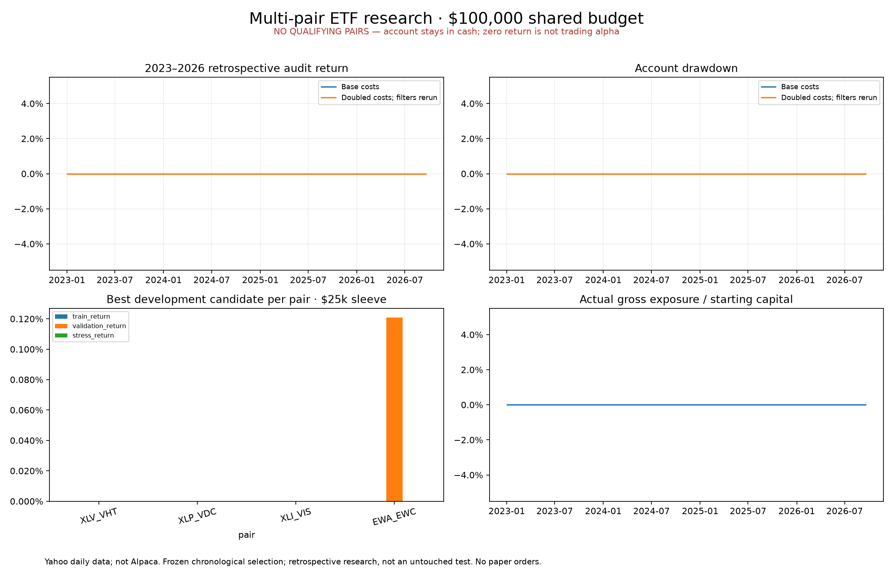

# Kalman Pairs Trading (Paper-First)

A GitHub-ready research and paper-trading project for U.S. equity pairs. The strategy is based on Jia Yu (2023): it screens pairs for cointegration, updates the hedge ratio online with a one-dimensional Kalman filter, and generates trading signals from a rolling, look-ahead-safe z-score.

> For research purposes only. This project is not financial advice. It sends no orders by default. The Alpaca integration is restricted to `paper=True`; observe paper performance, execution quality, and short-borrow constraints for an extended period before considering any further use.

## Latest: Multi-pair Research and Free API

Selected **Alpaca Basic / Paper Only** for the next paper-data integration. It requires
free account API keys; the authenticated feed has not yet been downloaded or tested.
[Setup, coverage and limitations](docs/FREE_DATA.md).

The current research uses **Yahoo daily data**, not Alpaca. It evaluates six economically
related ETF pairs (12 symbols), excludes two pairs with unsupported split events, and tests
six dynamic linear models per remaining pair. Training is 2017–2019, validation 2020–2022,
and the frozen selection is audited over 2023–September 18, 2026.

**No candidate passed the cost-aware acceptance criteria.** The $100,000 account therefore
remains in cash: 0% return, 0 trades, and $0 supported strategy allocation. This is a rejected
research result, not evidence of profitable trading or improved performance.
Each eligible pair would receive a separate $25,000 sleeve, with at most four disjoint pairs.
Conditional hedge ratios are reported for research, but rejected candidates receive no funds.



- [Current report](reports/2026-09-19/REPORT.md)
- [All candidate results](reports/2026-09-19/search.csv)
- [Conditional hedge ratios and supported capital](reports/2026-09-19/latest_hedges.csv)
- [Data and figures](reports/2026-09-19/backtest_bundle.zip)

```bash
pip install -e '.[data,charts,dev]'
pairs-trader download --symbols EWA EWC XLE VDE XLF VFH XLP VDC XLV VHT XLI VIS --start 2015-01-01 --end 2026-09-19 --output output/multi_pair/market_data
python scripts/evaluate_multi_pair.py
```

This writes current research results to `output/multi_pair/results/`.
Published reports contain only this version; older report files have been replaced.
The multi-pair model remains separate from paper-order submission. This is daily research,
not a high-frequency backtest, and minimum-variance hedging does not ensure market-beta neutrality.

## Paper Alignment and Engineering Improvements

- Core model: `spread = price_y - beta_t * price_x`, with `beta_t` updated by the Kalman filter as new prices arrive.
- Signals: short the spread when the z-score crosses above `+entry_z`, go long when it crosses below `-entry_z`, and exit when it reverts to `exit_z`.
- Pair selection: includes a Johansen trace test and requires both price series to pass an I(1) check first.
- Look-ahead protection: a signal generated on one bar is executed on the next; rolling means and standard deviations use only information available through the previous bar.
- Trading realism: models fees, slippage, maximum holding periods, stop-loss z-scores, per-pair capital limits, data freshness, whole-share quantities, and rollback behavior when paired orders fail.
- Risks outside the paper's model: live borrow availability, dividends, corporate actions, partial fills, and market impact still require broker-side monitoring.

## Run in 30 Seconds (No Account or Network Required)

```bash
python -m venv .venv
source .venv/bin/activate
pip install -e .
python -m pairs_trading.cli demo --output output/demo
```

This creates `equity.csv`, `trades.csv`, `signals.csv`, and `summary.json`. You can also provide your own adjusted daily-price CSV:

```bash
pairs-trader backtest --csv data/prices.csv --x EWA --y EWC --output output/ewa_ewc
```

The CSV must have the columns `date,EWA,EWC`, with dates in ascending order and adjusted closing prices in each symbol column.

Run the paper's Johansen pair-selection procedure on a universe CSV:

```bash
pairs-trader select --csv data/universe.csv
```

## Configure Alpaca Paper Trading

```bash
pip install -e '.[alpaca]'
cp .env.example .env
# Keep credentials in your local environment and never commit .env
export APCA_API_KEY_ID='...'
export APCA_API_SECRET_KEY='...'
export ALLOW_PAPER_ORDERS=true
pairs-trader paper --x EWA --y EWC --lookback-days 400
```

The `paper` command performs one decision cycle, making it suitable for GitHub Actions, cron, or another scheduler after the U.S. market closes. By default, the first run records signals only; simulated orders are submitted only when `ALLOW_PAPER_ORDERS=true` is explicitly enabled. Before opening a position, the command checks both existing legs to prevent duplicate entries. If it detects an orphaned leg, it stops and requests manual intervention. The integration follows the official SDK pattern with `TradingClient(..., paper=True)` and obtains market data separately through `StockHistoricalDataClient`.

## Backtesting and Pre-Deployment Checklist

```bash
python -m unittest discover -s tests -v
```

1. Perform walk-forward validation on periods that were not used for parameter tuning; do not rely solely on the paper's sample.
2. Confirm that both series remain I(1) and cointegrated under current market conditions. Stop opening positions when the relationship breaks down.
3. Verify that the Alpaca paper account permits shorting both symbols, and monitor whether both legs of each paired order fill.
4. Keep `ALLOW_PAPER_ORDERS=false` while reviewing logs, then enable simulated orders deliberately.
5. This repository does not provide a live-trading switch. Any live deployment requires a separate code and risk review.

## Project Structure

```text
src/pairs_trading/  Strategy, backtesting, data, and broker adapter
tests/              Network-free unit tests
config/default.json Default risk and signal parameters
.github/workflows/  Continuous integration
```

## Reference

Yu, J. (2023). "Cointegration Approach for the Pair Trading Based on the Kalman Filter." In V. Escudero et al. (Eds.), *Proceedings of the 2022 2nd International Conference on Business Administration and Data Science (BADS 2022)*, Atlantis Highlights in Computer Sciences, Vol. 11, pp. 633-642. Atlantis Press. [https://doi.org/10.2991/978-94-6463-102-9_66](https://doi.org/10.2991/978-94-6463-102-9_66)

The paper is available under the [Creative Commons Attribution-NonCommercial 4.0 International License](https://creativecommons.org/licenses/by-nc/4.0/). This project is an independent software implementation and is not affiliated with the paper's author or publisher. It is not a reproduction of the paper's source code; where the paper is ambiguous, the project uses conservative, testable engineering definitions.
