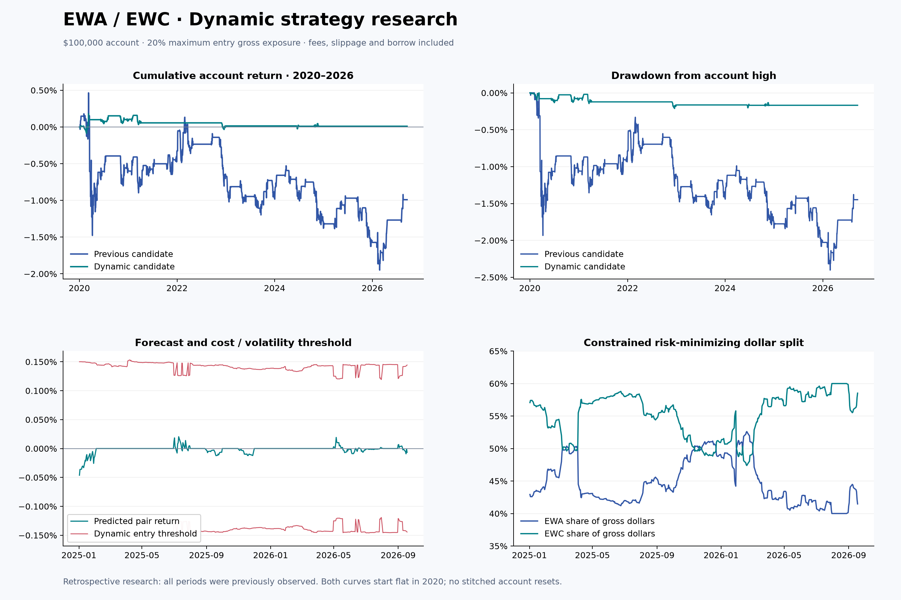
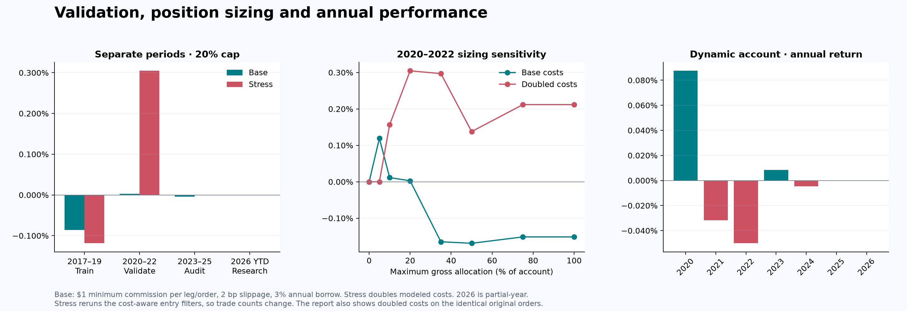

# Dynamic Signals and Hedge Allocation

This supplement preserves the earlier report and adds the final dynamic research version.
The continuous January 2020–September 18, 2026 diagnostic run made **+0.010%** with
**0.212% maximum drawdown**, but averaged only **$510 gross exposure** on $100,000.
It failed the earlier acceptance tests and made **no trades in 2026**. The supported
allocation is still zero; the small positive aggregate result is not a validated trading edge.

## Performance Figures

The stress scenario reruns entry filters, so its trade count can differ. The full report
also includes doubled costs on the identical base orders. The figures use the same
20% gross entry cap, but actual exposure differs materially between strategies.
The previous engine sizes at fill prices; the new engine fixes shares at the signal close.
Neither the risk nor the return comparison isolates prediction quality alone.

## Data and Reproduction

- [Complete ZIP bundle](backtest_bundle.zip): figures and derived research data.
- [Full report (Chinese)](REPORT.md): rules, results, cost assumptions and limitations.
- [Evaluation JSON](evaluation.json): all period, allocation and ablation results.
- [Protocol](protocol.json): search history, dates and decision criteria.
- [Daily signals](dynamic_signals.csv): forecasts, dollar weights, share ratios and risk estimates.
- [Monthly model fits](monthly_model_fits.csv): coefficients, sample counts and last-label maturity.
- [All 72 configurations](training_search.csv) and [validation finalists](validation_candidates.csv).
- [Position sizing results](sizing.csv).
- [Continuous dynamic equity](continuous_dynamic/equity.csv) and [order events](continuous_dynamic/trades.csv).
- [First ridge research round](initial_ridge_round/evaluation.json): preserved exploratory result,
  not the final selected candidate. Its training and validation searches are in the same directory.
- [Provenance and hashes](provenance.json).
- SVG versions: [performance](performance.svg), [validation and sizing](validation_and_sizing.svg).

From the repository root, use the reproduction commands in the main README.
The script writes to `output/dynamic/`; this dated supplement is an archived snapshot.
All history was previously observed, so the analysis is exploratory and retrospective.
No paper orders are submitted by the research script.

## Field Definitions

| File/field | Meaning |
|---|---|
| `equity.csv: equity` | Account equity in USD, including modeled expenses and dividend cash flows |
| `qx`, `qy` | Signed EWA and EWC shares; negative means short |
| `gross`, `net` | Absolute total and signed net notional value in USD |
| `prediction` | Forecast pair return per gross dollar over the configured horizon |
| `entry_threshold` | Required return after cost estimate and volatility confidence margin |
| `weight_x`, `weight_y` | Target EWA/EWC fractions of gross dollars; not cash or margin requirements |
| `share_ratio_x_per_y` | Absolute EWA shares per EWC share, before integer rounding |
| `desired_fraction` | Pre-rounding diagnostic gross allocation fraction; not proof an order filled |
| `trades.csv: signal_date` | Date at which order quantities were fixed; final scheduled exits are marked separately |
| `trades.csv: date` | Simulated execution date |
| `delta_qx`, `delta_qy` | Signed share changes on the execution event |
| `commission`, `slippage` | USD expenses for that order event; borrow is charged between dates |
| `stopped` | Historical 5% drawdown circuit breaker has triggered for that run |

The hedge optimization minimizes a stated variance/turnover objective under a
40%–60% dollar-weight constraint. It does not prove market-beta neutrality or maximize
future profits. As of September 18, the estimated split is 41.48% EWA / 58.52% EWC,
but the actual diagnostic signal requests zero shares after the cost check.
